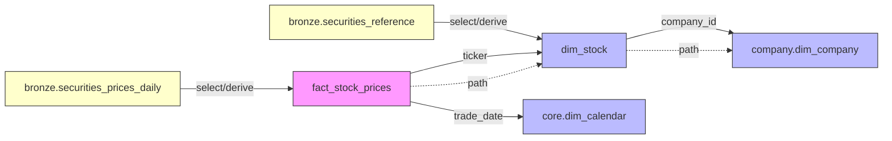

# Graph Architecture Overview

**Understanding the graph-based dimensional modeling system**

---

## Overview

de_Funk is a graphical overlay to a unified relational model enabling low-code interactions with data warehouses. It uses a **directed acyclic graph (DAG)** to define dimensional models declaratively.

This graph-based approach enables you to define **what** you want (schema structure) in YAML, and the framework figures out **how** to build it - regardless of domain or data source.

### Core Concept

Instead of writing procedural code to build each model, you declare:
- **Nodes**: Tables (dimensions and facts)
- **Edges**: Relationships (foreign keys, join paths)
- **Paths**: Materialized views (pre-joined denormalized tables)

The BaseModel framework then:
1. Reads your YAML graph definition
2. Loads source data from Bronze layer
3. Applies transformations (select, derive, unique_key)
4. Validates relationships (edges)
5. Creates materialized views (paths)
6. Persists to Silver layer

---

## Why Graph-Based Modeling?

### Traditional Approach (Procedural)

```python
# Old way: Manual, repetitive, error-prone
def build_stocks_model():
    # Load tables
    ticker_df = spark.read.parquet("bronze/securities_reference")
    prices_df = spark.read.parquet("bronze/securities_prices_daily")

    # Transform
    dim_stock = ticker_df.select("ticker", "name", "primary_exchange")
    fact_prices = prices_df.select("ticker", "trade_date", "open", "close")

    # Join
    prices_with_company = fact_prices.join(dim_stock, "ticker")

    # Write
    dim_stock.write.parquet("silver/stocks/dims/dim_stock")
    fact_prices.write.parquet("silver/stocks/facts/fact_stock_prices")

    return dim_stock, fact_prices
```

### Graph-Based Approach (Declarative)

```yaml
# New way: Declarative, reusable, validated
model: stocks
graph:
  nodes:
    - id: dim_stock
      from: bronze.securities_reference
      select:
        ticker: ticker
        name: name
        exchange: primary_exchange

    - id: fact_stock_prices
      from: bronze.securities_prices_daily
      select:
        ticker: ticker
        trade_date: trade_date
        open_price: open
        close_price: close

  edges:
    - from: fact_stock_prices
      to: dim_stock
      on: [ticker = ticker]

  paths:
    - id: stock_prices_with_company
      hops: fact_stock_prices -> dim_stock
```

**Benefits:**
- No Python code needed for standard transformations
- Automatic validation of relationships
- Backend agnostic (works with Spark or DuckDB)
- Declarative configuration
- Supports cross-model references
- Automatic query planning

---

## Graph Components

### Nodes

**Definition**: Nodes represent tables (dimensions or facts) in your model.

**Types:**
- **Dimension Nodes**: Reference data (prefix: `dim_`)
- **Fact Nodes**: Transactional data (prefix: `fact_`)

**Node Configuration:**

```yaml
nodes:
  - id: dim_stock                     # Unique node identifier
    from: bronze.securities_reference # Source: bronze layer table
    select:                           # Column selection/aliasing
      ticker: ticker
      name: name
      exchange: primary_exchange
    derive:                           # Computed columns
      stock_key: sha1(ticker)
      upper_ticker: UPPER(ticker)
    unique_key: [ticker]              # Deduplication constraint
```

**Loading Sources:**

1. **From Bronze**: `from: bronze.table_name`
   ```yaml
   - id: dim_stock
     from: bronze.securities_reference
   ```

2. **From Another Node**: `from: node_id`
   ```yaml
   - id: fact_prices_normalized
     from: fact_stock_prices    # Derive from existing node
   ```

3. **Cross-Model**: Handled via edges/paths, not direct node loading

**Transformations:**

**Select**: Column selection and renaming
```yaml
select:
  output_name: source_column
  ticker: ticker               # Keep same name
  company_name: name          # Rename column
```

**Derive**: Computed columns (SQL expressions)
```yaml
derive:
  equity_key: sha1(ticker)                    # Hash function
  price_range: high - low                     # Arithmetic
  returns: (close - open) / open * 100        # Complex expression
  rank: ROW_NUMBER() OVER (ORDER BY close)    # Window function
```

**Unique Key**: Deduplication
```yaml
unique_key: [ticker]              # Single column
unique_key: [ticker, trade_date]  # Composite key
```

---

### Edges

**Definition**: Edges represent relationships (foreign keys) between nodes.

**Purpose:**
- Define how tables relate to each other
- Enable automatic join path discovery
- Validate that relationships are valid

**Edge Configuration:**

```yaml
edges:
  - from: fact_stock_prices       # Source table
    to: dim_stock                 # Target table
    on: [ticker = ticker]         # Join condition

  - from: fact_stock_prices
    to: core.dim_calendar         # Cross-model reference
    on: [trade_date = date]
```

**Join Specifications:**

**Explicit Join Keys:**
```yaml
on: [ticker = ticker]                        # Single key
on: [ticker = ticker, exchange = exchange]   # Composite key
on: [left_col = right_col]                   # Different names
```

**Inferred Join Keys:**
```yaml
on: []   # Empty: auto-infer from common column names
```

**Edge Validation:**

BaseModel automatically validates edges during build:
1. Both nodes exist (local or cross-model)
2. Join columns exist in both DataFrames
3. Join is valid (executes `limit(1)` test join)

**Cross-Model Edges:**

```yaml
edges:
  # Link to calendar dimension in core model
  - from: fact_stock_prices
    to: core.dim_calendar
    on: [trade_date = date]

  # Link to company dimension in company model
  - from: dim_stock
    to: company.dim_company
    on: [company_id = company_id]
```

---

### Paths

**Definition**: Paths represent materialized views created by joining nodes along a chain.

**Purpose:**
- Pre-compute common joins
- Optimize query performance
- Create denormalized views for analytics

**Path Configuration:**

```yaml
paths:
  - id: stock_prices_with_company
    hops: fact_stock_prices -> dim_stock -> company.dim_company
```

**Hop Specifications:**

**Multi-hop Path:**
```yaml
hops: fact_stock_prices -> dim_stock -> company.dim_company
```

**Two-node Path:**
```yaml
hops: fact_stock_prices -> dim_stock
```

**Array Format:**
```yaml
hops:
  - fact_stock_prices
  - dim_stock
  - company.dim_company
```

**Path Materialization Process:**

1. Parse hops into chain: `[A, B, C]`
2. Resolve each node (supports cross-model)
3. Find edge between A and B
4. Join A with B
5. Find edge between (A+B) and C
6. Join (A+B) with C
7. Deduplicate columns
8. Return materialized DataFrame

**Example Path:**

```yaml
# YAML definition
paths:
  - id: stock_prices_enriched
    hops: fact_stock_prices -> dim_stock -> company.dim_company
```

Produces DataFrame with columns from all three tables:
- `fact_stock_prices`: ticker, trade_date, open, close, volume
- `dim_stock`: name, exchange, sector
- `company.dim_company`: company_name, headquarters, industry

---

## Graph Execution Flow

### Build Process

```
1. before_build()
   ↓
2. _build_nodes()
   - Load from Bronze
   - Apply select
   - Apply derive
   - Enforce unique_key
   ↓
3. _apply_edges()
   - Validate all edges
   - Test joins with limit(1)
   ↓
4. _materialize_paths()
   - Join nodes along hops
   - Create denormalized views
   ↓
5. Separate dims and facts
   - dims: nodes starting with "dim_"
   - facts: nodes starting with "fact_" + paths
   ↓
6. after_build()
   - Apply custom transformations
   ↓
7. Return (dims, facts)
```

### Node Building Order

**Dependency Resolution:**

Nodes must be defined in dependency order in YAML:

```yaml
# Correct order
nodes:
  - id: dim_stock               # Built first
    from: bronze.securities_reference

  - id: fact_stock_prices       # Built second
    from: bronze.securities_prices_daily

  - id: fact_prices_normalized  # Built third
    from: fact_stock_prices     # Depends on previous node
```

**Incorrect Order:**

```yaml
# WRONG: fact_prices_normalized built before fact_stock_prices
nodes:
  - id: fact_prices_normalized
    from: fact_stock_prices   # ERROR: not built yet!

  - id: fact_stock_prices
    from: bronze.securities_prices_daily
```

---

## Cross-Model Graph References

### Model Dependency Graph

Models can reference tables from other models via the dependency graph:

```
Tier 0 (Foundation):
  └── core (calendar dimension)

Tier 1 (Independent):
  ├── company (corporate entities)
  └── macro (economic indicators)

Tier 2 (Dependent):
  └── stocks (securities) → depends on: core, company
```

### Declaring Dependencies

**YAML Configuration:**

```yaml
model: stocks
version: 2.0
depends_on:
  - core
  - company
```

### Using Cross-Model References

**In Nodes:**
```yaml
# Cannot load cross-model tables directly in nodes
# Use edges and paths instead
```

**In Edges:**
```yaml
edges:
  - from: fact_stock_prices
    to: core.dim_calendar      # Cross-model edge
    on: [trade_date = date]

  - from: dim_stock
    to: company.dim_company    # Cross-model edge
    on: [company_id = company_id]
```

**In Paths:**
```yaml
paths:
  - id: stock_prices_enriched
    hops: fact_stock_prices -> dim_stock -> company.dim_company
```

### Cross-Model Resolution Process

When `_resolve_node()` encounters `company.dim_company`:

1. Parse `model_name.table_name` → `("company", "dim_company")`
2. Check if `model.session` is set (injected by UniversalSession)
3. Get company model instance: `session.get_model_instance("company")`
4. Ensure company model is built: `company_model.ensure_built()`
5. Fetch table: `company_model.get_dimension_df("dim_company")`
6. Return DataFrame

**Requires:** Model must have session injected via `set_session()`

---

## Backend Support

### Spark Backend

**Features:**
- Full graph support (nodes, edges, paths)
- Schema merging for Bronze tables
- Partition support
- Window functions in derive
- Edge validation with dry-run joins

**Example:**
```python
ctx = RepoContext.from_repo_root(connection_type="spark")
model = registry.create_model_instance("stocks", ctx.connection, ctx.storage)
```

### DuckDB Backend

**Features:**
- Node building with select/derive
- Unique key constraints
- Fast Parquet reading
- SQL expressions in derive

**Limitations:**
- Edge validation skipped (no test joins)
- Path materialization skipped (no joins yet)

**Example:**
```python
ctx = RepoContext.from_repo_root(connection_type="duckdb")
model = registry.create_model_instance("stocks", ctx.connection, ctx.storage)
```

---

## Graph Visualization

### Mermaid Diagram Example



### NetworkX Integration

BaseModel uses NetworkX internally for:
- Dependency resolution
- Path finding
- Topological sorting
- Cycle detection

See: `models/api/graph.py` for model-level graph management

---

## Best Practices

### 1. Node Naming Conventions

```yaml
# Dimensions: dim_ prefix
- id: dim_stock
- id: dim_company
- id: dim_calendar

# Facts: fact_ prefix
- id: fact_stock_prices
- id: fact_news
- id: fact_forecasts

# Paths: descriptive names
- id: stock_prices_with_company
- id: news_with_company
```

### 2. Edge Definition

```yaml
# Always define edges explicitly for clarity
edges:
  - from: fact_stock_prices
    to: dim_stock
    on: [ticker = ticker]   # Explicit join keys preferred
```

### 3. Path Planning

```yaml
# Create paths for common query patterns
paths:
  # Analysts frequently join prices with company info
  - id: stock_prices_with_company
    hops: fact_stock_prices -> dim_stock -> company.dim_company
```

### 4. Cross-Model References

```yaml
# Declare dependencies in YAML
depends_on:
  - core
  - company

# Use in edges and paths
edges:
  - from: fact_stock_prices
    to: core.dim_calendar
    on: [trade_date = date]
```

### 5. Node Build Order

```yaml
# Dependencies first, then dependents
nodes:
  - id: dim_stock           # Independent
  - id: fact_stock_prices   # Independent
  - id: fact_normalized     # Depends on fact_stock_prices
```

---

## Common Patterns

### Star Schema

```yaml
# Central fact surrounded by dimensions
nodes:
  - id: fact_stock_prices   # Fact (center)
  - id: dim_stock           # Dimension
  - id: dim_calendar        # Dimension
  - id: dim_exchange        # Dimension

edges:
  - from: fact_stock_prices
    to: dim_stock
  - from: fact_stock_prices
    to: dim_calendar
  - from: fact_stock_prices
    to: dim_exchange
```

### Snowflake Schema

```yaml
# Dimensions connect to other dimensions
nodes:
  - id: fact_stock_prices
  - id: dim_stock
  - id: dim_company
  - id: dim_industry

edges:
  - from: fact_stock_prices
    to: dim_stock
  - from: dim_stock
    to: dim_company
  - from: dim_company
    to: dim_industry
```

### Derived Facts

```yaml
# Create fact from another fact
nodes:
  - id: fact_stock_prices
    from: bronze.securities_prices_daily

  - id: fact_daily_returns
    from: fact_stock_prices
    derive:
      daily_return: (close - open) / open * 100
```

---

## Troubleshooting

### Node Not Found

**Error:** `Node 'dim_stock' not found`

**Causes:**
- Typo in node ID
- Node not defined in graph.nodes
- Node defined after it's referenced

**Solution:** Define nodes in dependency order

### Edge Validation Failed

**Error:** `Edge validation failed: fact_prices -> dim_stock`

**Causes:**
- Join column doesn't exist
- Column name typo
- Schema mismatch

**Solution:** Verify join keys exist in both DataFrames

### Cross-Model Reference Failed

**Error:** `Cross-model reference 'core.dim_calendar' failed`

**Causes:**
- Model not in dependencies
- Session not injected
- Referenced model not built

**Solution:**
1. Add to `depends_on` in YAML
2. Ensure UniversalSession injects session
3. Build dependency models first

### Path Materialization Failed

**Error:** `Path materialization failed for 'stock_prices_enriched'`

**Causes:**
- Invalid hop chain
- Missing edge between nodes
- Cross-model table not found

**Solution:** Verify all edges exist for hop chain

---

## Related Documentation

- [BaseModel Reference](../01-core-framework/base-model.md)
- [Nodes, Edges, Paths Details](nodes-edges-paths.md)
- [Cross-Model References](cross-model-references.md)
- [YAML Configuration](../05-measure-framework/yaml-configuration.md)
- [Model Dependency Analysis](/MODEL_DEPENDENCY_ANALYSIS.md)
